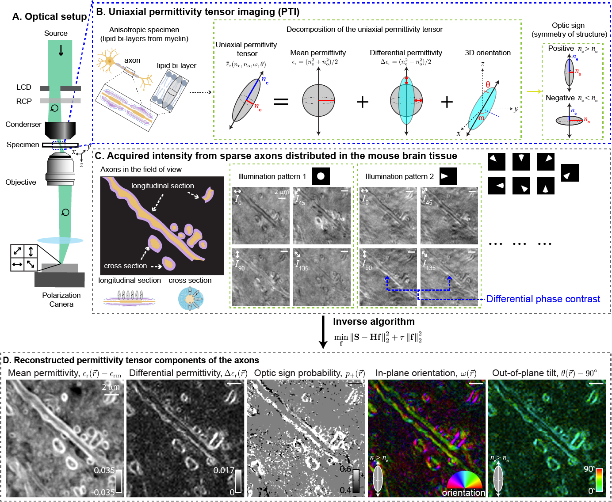

# waveorder


[](https://pepy.tech/project/waveorder)
[](https://pypi.org/project/waveorder)
[](https://en.wikipedia.org/wiki/Software_release_life_cycle#Alpha)

This package enables wave-optical simulation and reconstruction of optical properties that report microscopic architectural order. 

This vectorial wave simulator and reconstructor enabled the development of a new label-free imaging method, __permittivity tensor imaging (PTI)__, that reconstructs density (phase) and 3D anisotropy (principal retardance, 3D orientation of the optic axis, and optic sign) of specimens from polarization-resolved images acquired under a sequence of oblique illuminations.

The acquisition, calibration, background correction, reconstruction, and applications of PTI are described in the following [preprint](https://doi.org/10.1101/2020.12.15.422951):

```bibtex
 L.-H. Yeh, I. E. Ivanov, B. B. Chhun, S.-M. Guo, E. Hashemi, J. R. Byrum, J. A. Pérez-Bermejo, H. Wang, Y. Yu, P. G. Kazansky, B. R. Conklin, M. H. Han, and S. B. Mehta, "uPTI: uniaxial permittivity tensor imaging of intrinsic density and anisotropy," bioRxiv 2020.12.15.422951 (2020).
 ```

Please cite this repository, along with the relevant preprint or paper, if you use or adapt this code.

PTI provides volumetric reconstructions of phase, principal retardance, 3D orientation, and optic sign from a polarization- and illumination-diverse acquisition. The following figure summarizes PTI acquisitions and reconstructions with simulated phantoms: 



In addition to PTI, `waveorder` also enables simulations and reconstructions of subsets of label-free measurements with subsets of the acquired data:

1. Reconstruction of 2D or 3D phase, projected retardance, and in-plane orientation from a polarization-diverse volumetric brightfield acquisition ([QLIPP](https://elifesciences.org/articles/55502))

2. Reconstruction of 2D or 3D phase from a volumetric brightfield acquisition ([2D](https://www.osapublishing.org/ao/abstract.cfm?uri=ao-54-28-8566)/[3D (PODT)](https://www.osapublishing.org/ao/abstract.cfm?uri=ao-57-1-a205) phase)

3. Reconstruction of 2D or 3D phase from an illumination-diverse volumetric acquisition ([2D](https://www.osapublishing.org/oe/fulltext.cfm?uri=oe-23-9-11394&id=315599)/[3D](https://www.osapublishing.org/boe/fulltext.cfm?uri=boe-7-10-3940&id=349951) differential phase contrast)

The [example notebooks](examples/) contain simulations for 2D QLIPP, 3D PODT, and 2D/3D PTI. 

If you are interested in using QLIPP or PODT for label-free imaging at scale, checkout our [napari plugin](https://www.napari-hub.org/plugins/recOrder-napari),  [`recOrder-napari`](https://github.com/mehta-lab/recOrder).

## Installation

(Optional but recommended) install [anaconda](https://www.anaconda.com/products/distribution) and create a virtual environment:

```sh
conda create -y -n waveorder python=3.9
conda activate waveorder
```
Install `waveorder` from PyPI:

```sh
pip install waveorder
```
Use `waveorder` in your scripts:
```sh
python
>>> import waveorder
```

(Optional) Download the repository, install `jupyter`, and experiment with the example notebooks
```sh
git clone https://github.com/mehta-lab/waveorder.git
pip install jupyter
jupyter notebook ./waveorder/examples/
```

(Optional) Use NVIDIA GPUs by installing `cupy` with [these instructions](https://docs.cupy.dev/en/stable/install.html). Check that `cupy` is properly installed with
```sh
python
>>> import cupy
```
To use GPUs in `waveorder` set ```use_gpu=True``` when initializing the simulator and reconstructor classes.