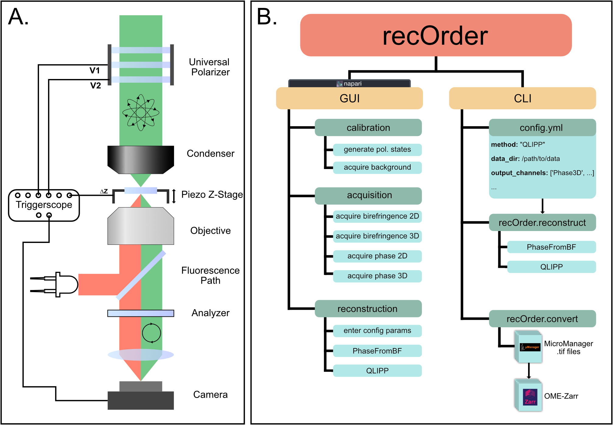

# recOrder
This package offers a comprehensive pipeline, command line interface, and napari plugins for quantitative label-free microscopy.

In this repo you will find python tools and UI that allow the user to calibrate microscope hardware, acquire multi-modal data, reconstruct density and anisotropy, and visualize the data.

The acquisition, calibration, background correction, reconstruction, and applications of QLIPP are described in the following [E-Life Paper](https://elifesciences.org/articles/55502):

``` Syuan-Ming Guo, Li-Hao Yeh, Jenny Folkesson, Ivan E Ivanov, Anitha P Krishnan, Matthew G Keefe, Ezzat Hashemi, David Shin, Bryant B Chhun, Nathan H Cho, Manuel D Leonetti, May H Han, Tomasz J Nowakowski, Shalin B Mehta, "Revealing architectural order with quantitative label-free imaging and deep learning," eLife 2020;9:e55502 DOI: 10.7554/eLife.55502 (2020).```


recOrder is to be used alongside the QLIPP module, whose design has been optimized to fit on a conventional widefield microscope (Panel A below).  The QLIPP module allows for the collection of label-free information consisting of the intrinsic anisotropy of the sample and its relative phase (density).  All of these measurements are collected through compensated, polarization diverse illumination and quantitatively recovered through recOrder's computational reconstruction pipeline.  The overall structure of recOrder can be visualized below in Panel B, highlighting the two different usage modes and their features: graphical user interface (GUI) through napari and command line interfact (CLI).

<p align="center">



</p>

## Dataset

[Slides](https://doi.org/10.5281/zenodo.5135889) and [dataset](https://doi.org/10.5281/zenodo.5178487) shared during a workshop on QLIPP and recOrder can be found on Zenodo.

[](https://doi.org/10.5281/zenodo.5178487)
[](https://doi.org/10.5281/zenodo.5135889)


## Installation

### Create a new conda environment
Install conda package management system by installing anaconda or miniconda ([link](https://conda.io/)). 

1) Creating a conda environment dedicated to `recOrder` will avoid version conflicts among packages required by `recOrder` and packages required by other python software.
>```buildoutcfg
>conda create -n <your-environment-name> python=3.7
>conda activate <your-environment-name> (or source activate <your-environment-name>)
>```

2) Then, install jupyter notebook with
>```buildoutcfg
>conda install jupyter
>```

### Install `recOrder` and required packages
Install the git version control system git : [link](https://git-scm.com/book/en/v2/Getting-Started-Installing-Git)

1) Use git to clone this repository to your current directory:
>```buildoutcfg
>git clone https://github.com/mehta-lab/recOrder.git
>```

2) Then, you can install dependencies via pip (python index package) <br>

>    If you are running recOrder on your own machine, <br>
>
>    a) navigate to the cloned repository:
>
>    ```buildoutcfg
>    cd recOrder
>    ```
>    <br>
>    b) install recOrder and dependencies:
>
>    ```buildoutcfg
>    pip install -e .
>    ```
>    <br>

*`recOrder` supports NVIDIA GPU computation through cupy package, please follow [here](https://github.com/cupy/cupy) for installation (check cupy is properly installed by ```import cupy```). To enable gpu processing, set ```use_gpu=True``` when initializing the simulator/reconstructor class.*

## Usage and example

In the following, we demonstrate how to run `recOrder` for reconstruction. <br>

1) In the terminal, switch to the environment with waveorder installed 
>  ```buildoutcfg
>  conda activate <your-environment-name>
>  ```

2) Navigate to the repository folder:
>  ```buildoutcfg
>  cd recOrder/example
>  ```

3) Open `config_example.yml` and modify the parameters to match your dataset:

3) Run reconstruction with the path to your config file
>  ```buildoutcfg
>  recOrder.reconstruct --config <path/to/config>
>  ```

## License
Chan Zuckerberg Biohub Software License

This software license is the 2-clause BSD license plus clause a third clause
that prohibits redistribution and use for commercial purposes without further
permission.

Copyright © 2019. Chan Zuckerberg Biohub.
All rights reserved.

Redistribution and use in source and binary forms, with or without
modification, are permitted provided that the following conditions are met:

1.	Redistributions of source code must retain the above copyright notice,
this list of conditions and the following disclaimer.

2.	Redistributions in binary form must reproduce the above copyright notice,
this list of conditions and the following disclaimer in the documentation
and/or other materials provided with the distribution.

3.	Redistributions and use for commercial purposes are not permitted without
the Chan Zuckerberg Biohub's written permission. For purposes of this license,
commercial purposes are the incorporation of the Chan Zuckerberg Biohub's
software into anything for which you will charge fees or other compensation or
use of the software to perform a commercial service for a third party.
Contact ip@czbiohub.org for commercial licensing opportunities.

THIS SOFTWARE IS PROVIDED BY THE COPYRIGHT HOLDERS AND CONTRIBUTORS "AS IS"
AND ANY EXPRESS OR IMPLIED WARRANTIES, INCLUDING, BUT NOT LIMITED TO, THE
IMPLIED WARRANTIES OF MERCHANTABILITY AND FITNESS FOR A PARTICULAR PURPOSE ARE
DISCLAIMED. IN NO EVENT SHALL THE COPYRIGHT HOLDER OR CONTRIBUTORS BE LIABLE
FOR ANY DIRECT, INDIRECT, INCIDENTAL, SPECIAL, EXEMPLARY, OR CONSEQUENTIAL
DAMAGES (INCLUDING, BUT NOT LIMITED TO, PROCUREMENT OF SUBSTITUTE GOODS OR
SERVICES; LOSS OF USE, DATA, OR PROFITS; OR BUSINESS INTERRUPTION) HOWEVER
CAUSED AND ON ANY THEORY OF LIABILITY, WHETHER IN CONTRACT, STRICT LIABILITY,
OR TORT (INCLUDING NEGLIGENCE OR OTHERWISE) ARISING IN ANY WAY OUT OF THE USE
OF THIS SOFTWARE, EVEN IF ADVISED OF THE POSSIBILITY OF SUCH DAMAGE. 
