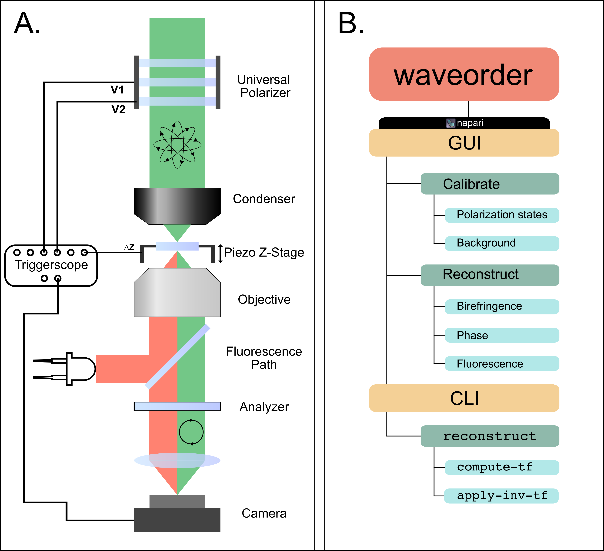

# waveorder

`waveorder` is a collection of computational imaging methods. It currently provides QLIPP (quantitative label-free imaging with phase and polarization), phase from defocus, and fluorescence deconvolution.

These are the kinds of data you can acquire with `waveorder` and QLIPP:

https://user-images.githubusercontent.com/9554101/271128301-cc71da57-df6f-401b-a955-796750a96d88.mov

https://user-images.githubusercontent.com/9554101/271128510-aa2180af-607f-4c0c-912c-c18dc4f29432.mp4

## What do I need to use `waveorder`
`waveorder` is to be used alongside a conventional widefield microscope. For QLIPP, the microscope must be fitted with an analyzer and a universal polarizer:

https://user-images.githubusercontent.com/9554101/273073475-70afb05a-1eb7-4019-9c42-af3e07bef723.mp4

For phase-from-defocus or fluorescence deconvolution methods, the universal polarizer is optional.

The overall structure of `waveorder` is shown in Panel B, highlighting the structure of the graphical user interface (GUI) through a napari plugin and the command-line interface (CLI) that allows users to perform reconstructions.



## Software Quick Start

(Optional but recommended) install [anaconda](https://www.anaconda.com/products/distribution) and create a virtual environment:

```sh
conda create -y -n waveorder python=3.12
conda activate waveorder
```

Install `waveorder` with acquisition dependencies
(napari with PyQt6 and pycro-manager):

```sh
pip install waveorder[all]
```

Install `waveorder` without napari, QtBindings (PyQt/PySide) and pycro-manager dependencies:

```sh
pip install waveorder
```

Open `napari` with `waveorder`:

```sh
napari -w waveorder
```

For more help, see [`waveorder`'s documentation](https://github.com/mehta-lab/waveorder/tree/main/docs). To install `waveorder`
on a microscope, see the [microscope installation guide](https://github.com/mehta-lab/waveorder/blob/main/docs/microscope-installation-guide.md).

## Dataset

[Slides](https://doi.org/10.5281/zenodo.5135889) and a [dataset](https://doi.org/10.5281/zenodo.5178487) shared during a workshop on QLIPP can be found on Zenodo, and the napari plugin's sample contributions (`File > Open Sample > waveorder` in napari).

[](https://doi.org/10.5281/zenodo.5178487)
[](https://doi.org/10.5281/zenodo.5135889)
