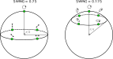
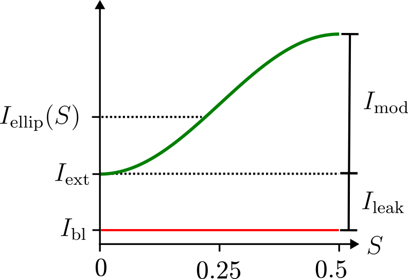

# Calibration guide
This guide describes `recOrder`'s calibration routine with details about its goals, parameters, and evaluation metrics. 

## Why calibrate?

`recOrder` sends commands via Micro-Manager (or a TriggerScope) to apply voltages to the liquid crystals which modify the polarization of the light that illuminates the sample. `recOrder` could apply a fixed set of voltages so the user would never have to worry about these details, but this approach leads to extremely poor performance because

- the sample, the sample holder, lenses, dichroics, and other optical elements introduce small changes in polarization, and 
- the liquid crystals' voltage response drifts over time.

Therefore, recalibrating the liquid crystals regularly (definitely between imaging sessions, often between different samples) is essential for acquiring optimal images. 

## Finding the extinction state

Every calibration starts with a routine that finds the **extinction state**: the polarization state (and corresponding voltages) that minimizes the intensity that reaches the camera. If the analyzer is a right-hand-circular polarizer, then the extinction state is the set of voltages that correspond to left-hand-circular light in the sample. 

## Setting a goal for the remaining states: swing 

After finding the circular extinction state, the calibration routine finds the remaining states. The **swing** parameter sets the target ellipticity of the remaining states and is best understood using [the Poincare sphere](https://en.wikipedia.org/wiki/Unpolarized_light#Poincar%C3%A9_sphere), a diagram that organizes all pure polarization states onto the surface of a sphere.

On the Poincare sphere, the extinction state corresponds to the north pole, and the swing value corresponds to the targeted line of [colatitude](https://en.m.wikipedia.org/wiki/File:Spherical_Coordinates_%28Colatitude,_Longitude%29.svg) for the remaining states. For example, a swing value of 0.25 (above left) sets the targeted polarization states to the states on the equator: a set of linear polarization states. Similarly, a swing value of 0.125 (above right) sets the targeted polarization states to the states on the line of colatitude 45 degrees ( $\pi$/4 radians) away from the north pole: a set of elliptical polarization states. 

The Poincare sphere is also useful for calculating the ratio of intensities measured before and after an analyzer illuminated with a polarized beam. First, find the point on the Poincare sphere that corresponds to the analyzer; in our case we have a right-circular analyzer corresponding to the south pole. Next, find the point that corresponds to the polarization state of the light incident on the analyzer; this could be any arbitrary point on the Poincare sphere. To find the ratio of intensities before and after the analyzer $I/I_0$, find the great-circle angle between the two points on the Poincare sphere, $\alpha$, and calculate $I/I_0 = \cos^2(\alpha/2)$. As expected, points that are close together transmit perfectly ( $\alpha = 0$ implies $I/I_0 = 1$), while antipodal points lead to extinction ( $\alpha = \pi$ implies $I/I_0 = 0$). 

This geometric construction illustrates that all non-extinction polarization states have the same intensity after the analyzer because they live on the same line of colatitude and have the same great-circle angle to the south pole (the analyzer). We use this fact to help us find our non-extinction states. 

Practically, we find our first non-extinction state immediately using the liquid crystal manufacturer's measurements from the factory. In other words, we apply a fixed voltage offset to the extinction-state voltages to find the first non-extinction state, and this requires no iteration or optimization. To find the remaining non-extinction states, we keep the polarization orientation fixed and search through neighboring states with different ellipticity to find states that transmit the same intensity as the first non-extinction state. 

## Evaluating a calibration: extinction ratio

At the end of a calibration we report the **extinction ratio**, the ratio of the largest and smallest intensities that the imaging system can transmit above background. This metric measures the quality of the entire optical path including the liquid crystals and their calibrated states, and all depolarization, scattering, or absorption caused by optical elements in the light path will reduce the extinction ratio. 

## Calculating extinction ratio from measured intensities (advanced topic)

To calculate the extinction ratio, we could optimize the liquid crystal voltages to maximize measured intensity then calculate the ratio of that result with the earlier extinction intensity, but this approach requires a time-consuming optimization and it does not characterize the quality of the calibrated states of the liquid crystals. 

Instead, we estimate the extinction ratio from the intensities we measure during the calibration process. Specifically, we measure the black-level intensity $I_{\text{bl}}$, the extinction intensity $I_{\text{ext}}$, and the intensity under the first elliptical state $I_{\text{ellip}}(S)$ where $S$ is the swing. We proceed to algebraically express the extinction ratio in terms of these three quantities.   

We can decompose $I_{\text{ellip}}(S)$ into a constant term $I_{\text{ellip}}(0) = I_{\text{ext}}$, and a modulation term given by 

$$I_{\text{ellip}}(S) = I_{\text{mod}}\sin^2(\pi S) + I_{\text{ext}},\qquad\qquad (1)$$
where $I_{\text{mod}}$ is the modulation depth, and the $\sin^2(\pi S)$ term can be understood using the Poincare sphere (the intensity behind the circular analyzer is proportional to $\cos^2(\alpha/2)$ and for a given swing we have $\alpha = \pi - 2\pi S$ so $\cos^2(\frac{\pi - 2\pi S}{2}) = \sin^2(\pi S)$ ).

Next, we decompose $I_{\text{ext}}$ into the sum of two terms, the black level intensity and a leakage intensity $I_{\text{leak}}$
$$I_{\text{ext}} = I_{\text{bl}} + I_{\text{leak}}.\qquad\qquad (2)$$

The following diagram clarifies our definitions and shows how the measured $I_{\text{ellip}}(S)$ depends on the swing (green line).

The extinction ratio is the ratio of the largest and smallest intensities that the imaging system can transmit above background, which is most easily expressed in terms of $I_{\text{mod}}$ and $I_{\text{leak}}$
$$\text{Extinction Ratio} = \frac{I_{\text{mod}} + I_{\text{leak}}}{I_{\text{leak}}}.\qquad\qquad (3)$$

Substituting Eqs. (1) and (2) into Eq. (3) gives the extinction ratio in terms of the measured intensities
$$\text{Extinction Ratio} = \frac{1}{\sin^2(\pi S)}\frac{I_{\text{ellip}}(S) - I_{\text{ext}}}{I_{\text{ext}} - I_{\text{bl}}} + 1.$$

## Summary: `recOrder`'s step-by-step calibration procedure
1. Close the shutter, measure the black level, then reopen the shutter. 
2. Find the extinction state by finding voltages that minimize the intensity that reaches the camera. 
3. Use the swing value to immediately find the first elliptical state, and record the intensity on the camera. 
4. For each remaining elliptical state, keep the polarization orientation fixed and optimize the voltages to match the intensity of the first elliptical state. 
5. Store the voltages and calculate the extinction ratio. 