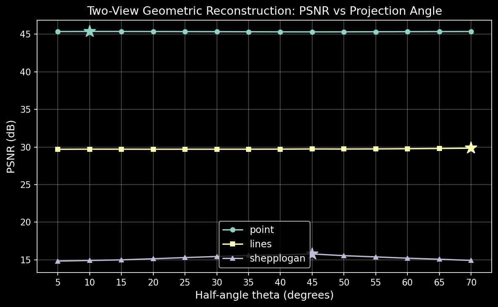
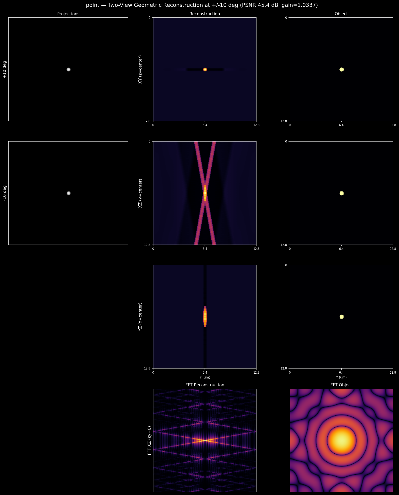
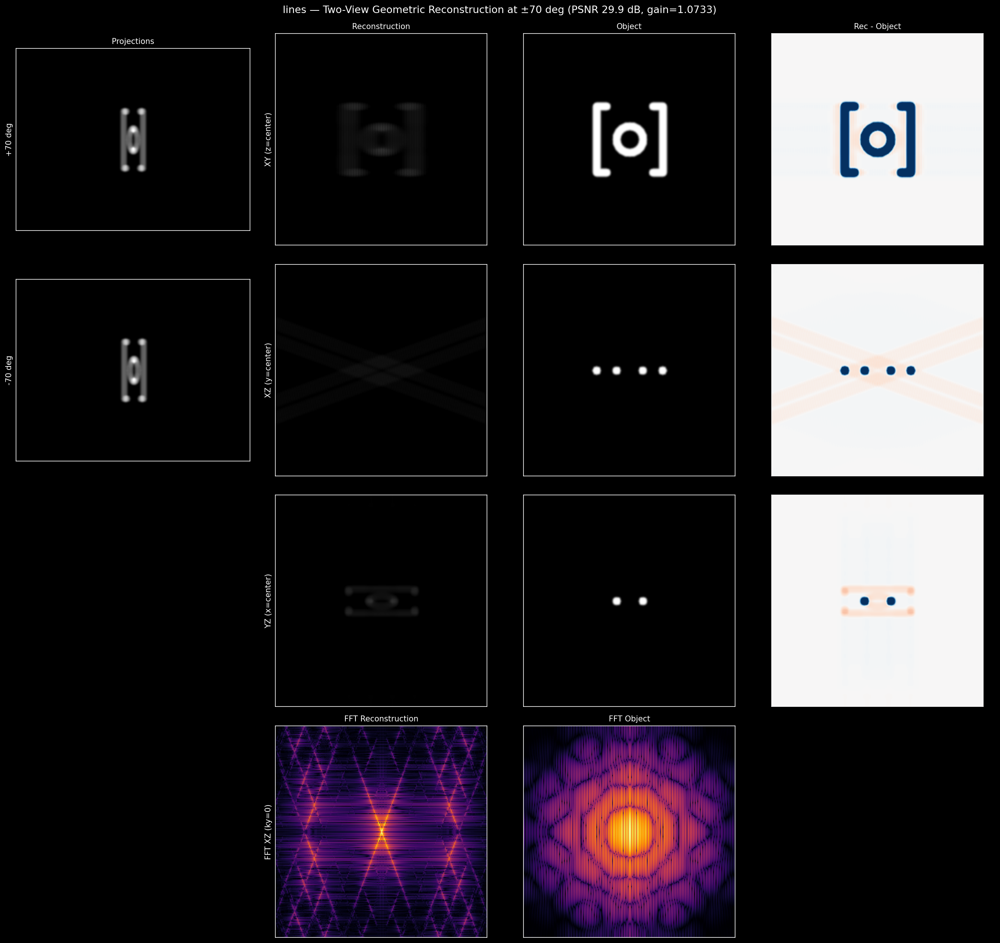
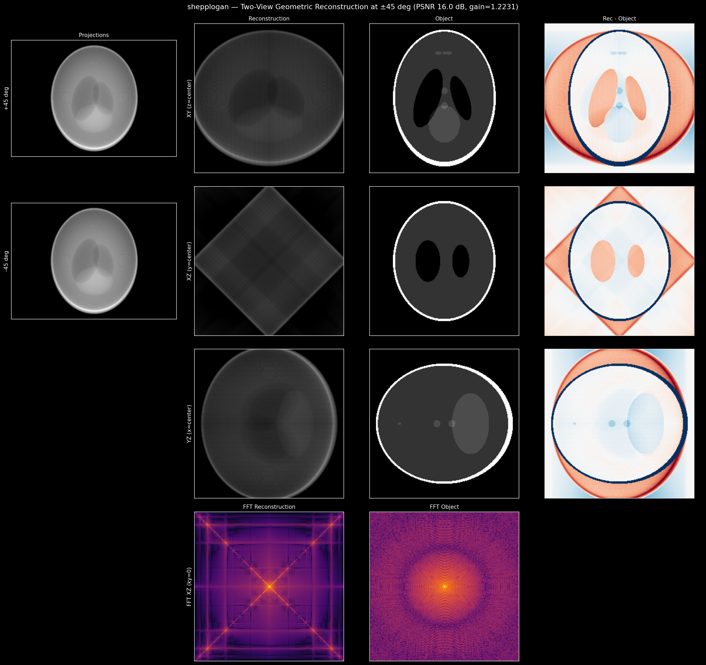
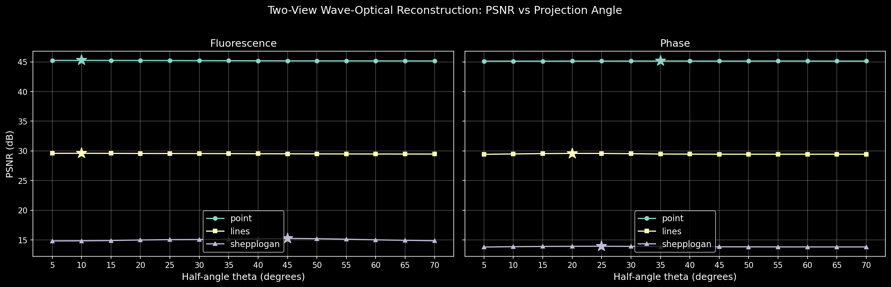
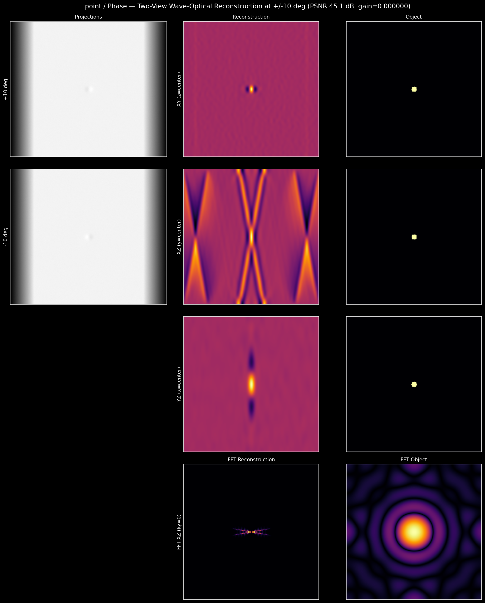
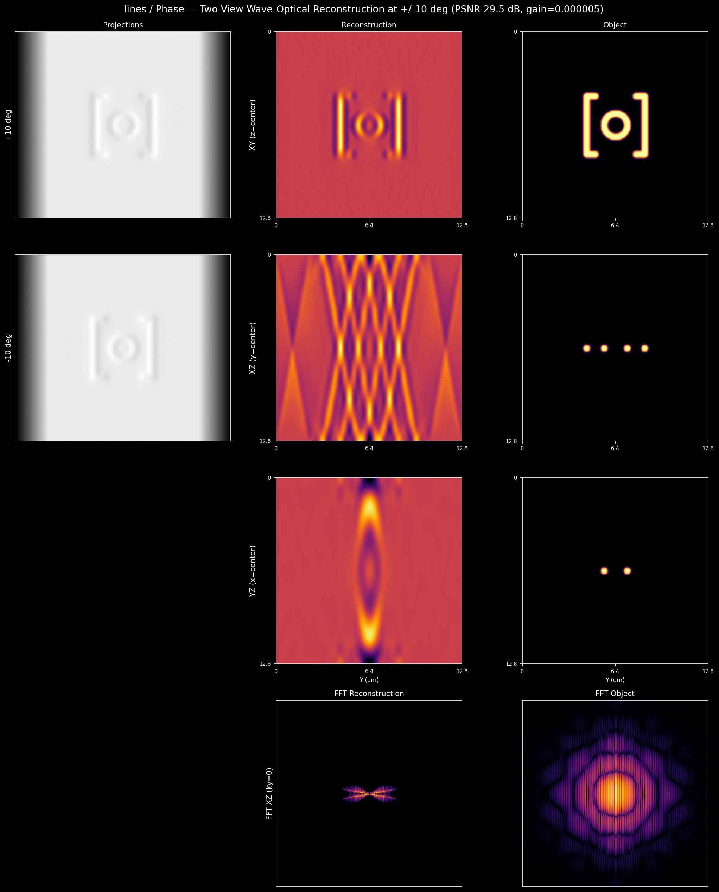
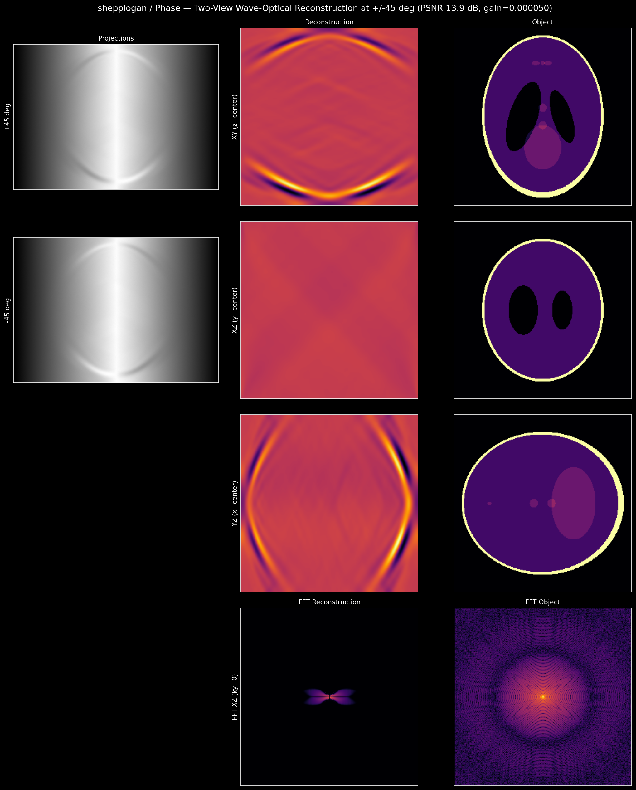
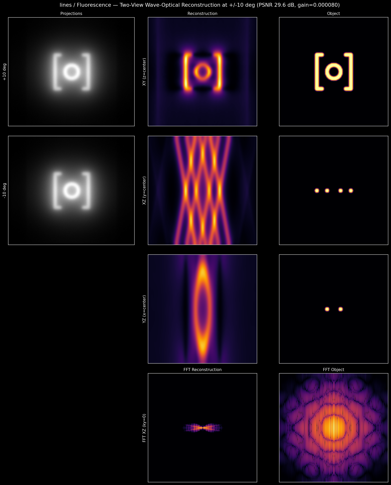
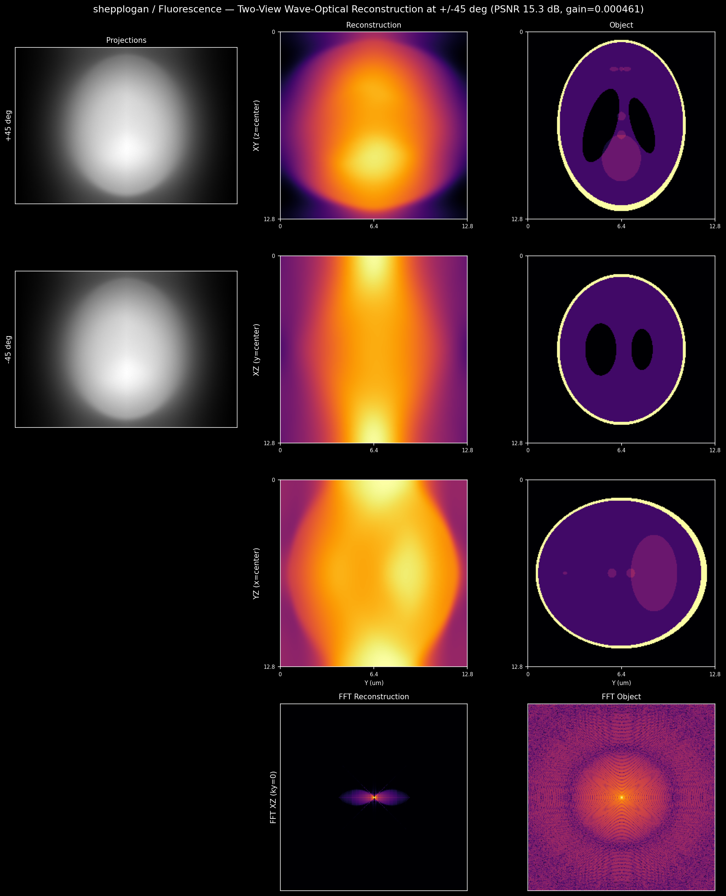

# Projection Modeling and Reconstruction

Three phantoms — point bead, line `[o]` pattern, Shepp-Logan — each with
fluorescence and phase channels (256^3, 50 nm isotropic). All
reconstructions use CG-Tikhonov (50 iterations, lambda = 0.001,
ramp-filtered backprojection). PSNR computed after optimal gain calibration
against the unblurred ground-truth object.

## Forward Simulation

1. Generate 3D phantom.
2. Blur with 3D transfer function (fluorescence OTF or phase TF).
3. Scale the intensities to [100, 1024] detector counts; add Poisson noise.
4. Compute Siddon mean-projections at 29 angles (-70 to +70 deg, 5 deg steps).

### Point

### Lines [o]

### Shepp-Logan

---

## 1. Limited-Angle Tomography (29 projections, no blur)

Forward model: Siddon ray-tracing at 29 angles (-70 to +70 deg). Source:
unblurred `object`. Each figure shows sinogram, reconstruction, object,
and kz-kx Fourier cross-sections.

### Point

### Lines [o]

### Shepp-Logan

The ±70 deg range leaves a missing cone of half-angle 20 deg along the
optical axis. XZ slices show axial elongation; Fourier panels confirm
structured banding where the ground truth has uniform support. PSNR
degrades with phantom complexity: the sparse point bead reconstructs well,
while the Shepp-Logan phantom's overlapping low-contrast ellipsoids make
the inverse problem ill-conditioned.

---

## 2. Two-View Tomography (2 projections, no blur)

Forward model: Siddon ray-tracing with two projections at ±theta. Source:
unblurred `object`. Theta swept from 5 to 70 deg in 5 deg steps.

### PSNR vs Projection Half-Angle

### Reconstructions at Optimal Angle

#### Point (±10 deg)

#### Lines [o] (±70 deg)

#### Shepp-Logan (±45 deg)

The optimal angle depends on phantom structure. The point bead is spectrally
compact — PSNR is flat across all thetas (45.3-45.4 dB). The lines pattern
benefits from wide-angle projections (monotonically increasing, peak at
±70 deg). Shepp-Logan peaks at ±45 deg, where two projections maximally
separate the overlapping ellipsoids.

Per-projection mean subtraction removes the common DC background before
reconstruction, focusing the solver on structural differences between views.
Two views lose 3-5 dB relative to 29 projections. The gap is smallest for
the sparse point bead (3.6 dB) and largest for the extended Shepp-Logan
(5.2 dB). Two projections sample only two Fourier slices; the XZ FFT panels
show energy along two narrow bands with the rest near zero.

Note: apparent aspect-ratio distortion at oblique projection angles

The Siddon operator projects in the ZX plane; each Y row is processed
independently. The Y extent of the reconstruction therefore matches the
object exactly at all angles (FWHM 231 vs 233 voxels for Shepp-Logan).
The X extent, however, depends on angular coverage. Two Fourier slices at
±theta leave large gaps along kx; the CG solver fills these gaps with
ringing that expands the effective X extent.

| Angle | Y FWHM | X FWHM | Y/X  |
|-------|--------|--------|------|
| Object | 233 | 175 | 1.33 |
| ±10 deg | 231 | 175 | 1.32 |
| ±45 deg | 231 | 255 | 0.91 |
| ±70 deg | 231 | 255 | 0.91 |

At ±10 deg (nearly vertical rays) the Fourier slices straddle the kx axis,
preserving X resolution. At ±45 or ±70 deg the slices tilt away from kx,
and the X FWHM expands to fill the volume. The Shepp-Logan ellipse thus
appears to change from taller-than-wide (Y/X = 1.33) to wider-than-tall
(Y/X ≈ 0.9), giving the visual impression of a 90-degree rotation. The
wave-optical two-view reconstruction (Section 4) avoids this effect because
its optimal angle for the lines phantom is ±10 deg and the OTF bandwidth
further suppresses high-frequency ringing.

This is an inherent resolution anisotropy of two-view tomography, not a
coordinate error.

---

## 3. Limited-Angle Tomography with Blur (29 projections, OTF)

Forward model: 3D OTF convolution + Siddon ray-tracing at 29 angles. Source:
blurred + noisy `rawimage`. By the Fourier-slice theorem, the 3D OTF
convolution before projection applies the angle-dependent 2D transfer
function at each tilt.

### PSNR

| Sample | Phase | Fluorescence |
|--------|-------|-------------|
| point | 45.37 dB | 45.86 dB |
| lines | 30.35 dB | 30.25 dB |
| shepplogan | 14.57 dB | 16.13 dB |

### Point

### Lines [o]

### Shepp-Logan

The wave model reconstructs worse than the geometric model. Three factors
compound: (1) the OTF zeros high frequencies that Tikhonov regularization
cannot recover; (2) Poisson noise fills the spectrum beyond the OTF
passband; (3) the gain mismatch between detector counts and physical units
(alpha_wave ~ 4e-5 vs alpha_geo ~ 1.0). The phase channel loses an
additional 1-3 dB because its transfer function has a null at kz = 0.

---

## 4. Two-View Tomography with Blur (2 projections, OTF)

Forward model: 3D OTF convolution + Siddon ray-tracing with two projections
at +/-theta. Source: blurred + noisy `rawimage`. Theta swept from 5 to 70 deg
in 5 deg steps; both fluorescence and phase channels reconstructed.

### PSNR vs Projection Half-Angle

### PSNR at Optimal Angle (by Fluorescence)

| Sample | Optimal theta | Phase | Fluorescence |
|--------|--------------|-------|-------------|
| point | +/-10 deg | 45.13 dB | 45.26 dB |
| lines | +/-10 deg | 29.50 dB | 29.60 dB |
| shepplogan | +/-45 deg | 13.85 dB | 15.26 dB |

### Point (+/-10 deg)

### Lines [o] (+/-10 deg)

### Shepp-Logan (+/-45 deg)

Per-projection mean subtraction removes the common DC background before
reconstruction, focusing the CG solver on structural differences between
views. After this correction the Shepp-Logan optimal angle shifts from
+/-20 to +/-45 deg, matching the geometric case (Section 2).

The phase channel varies less than 0.2 dB across all thetas because the
phase TF null at kz = 0 dominates information loss, regardless of
projection geometry. The fluorescence channel shows mild theta dependence:
PSNR peaks near +/-45 deg for the Shepp-Logan phantom but remains flat
for the spectrally compact point bead.

---

## Algorithms

### Forward models

**Geometric:** `H(x) = [siddon_project(x, theta) for theta in angles]`.
**Wave-optical:** `H(x) = [siddon_project(OTF * x, theta) for theta in angles]`.

The 3D OTF convolution (FFT on GPU) precedes Siddon projection. The adjoint
reverses both: `H^T(y) = conj(OTF) * sum(siddon_backproject(y_i, theta_i))`.

### Siddon ray-tracing

Each projection computes line integrals through a 3D volume at tilt angle
theta (rotation about Y in the ZX plane). Ray geometry is precomputed as a
sparse matrix A of shape (n_lateral, nz * nx). Forward projection:
`torch.sparse.mm(A, vol_zx)`; backprojection: `torch.sparse.mm(A.T, proj.T)`.

### Conjugate Gradient with Tikhonov regularization

Both models solve `(H*H + lambda I)x = H*y` via CG. Ramp-filtered
backprojection preconditions the normal operator so all frequencies converge
at a similar rate.

### Gain calibration

Before computing PSNR, the optimal gain `alpha = <recon, gt> / <recon, recon>`
removes the arbitrary scale between reconstruction and ground truth.

---

## Appendix: Fluorescence Channel Results

### Forward Simulation

#### Point

#### Lines [o]

#### Shepp-Logan

### Limited-Angle Tomography with Blur (29 projections, OTF)

#### Point

#### Lines [o]

#### Shepp-Logan

### Two-View Tomography with Blur (2 projections, OTF)

#### Point (+/-10 deg)

#### Lines [o] (+/-10 deg)

#### Shepp-Logan (+/-45 deg)

---

## Interactive Viewer

Browse all samples and reconstructions with
[ndimg](https://github.com/czbiohub-sf/nd-embedding-atlas):

    cd /path/to/nd-embedding-atlas
    uv run ndimg /path/to/projection_modeling.zarr --port 5055

Open http://localhost:5055. The table lists all 15 FOVs (3 samples × 5 data
columns); click any row to load the volume in the image viewer.

Or use napari with napari-ome-zarr plugin.