# Napari Plugin Guide
This guide summarizes a complete `waveorder` workflow.

## Launch `waveorder`
Activate the `waveorder` environment
```
conda activate waveorder
```

Launch `napari` with `waveorder`
```
napari -w waveorder
```
## Connect to Micro-Manager
Click "Connect to MM". If the connection succeeds, proceed to calibration. If not, revisit the [microscope installation guide](microscope-installation-guide.md).

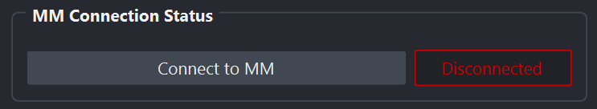

For polarization imaging, start with the **Calibration** tab. For phase-from-brightfield imaging, you can skip the calibration and go to the **Aquisition / Reconstruction** tab.

## Calibration tab
The first step in the acquisition process is to calibrate the liquid crystals and measure a background. In the `waveorder` plugin you will see the following options for controlling the calibration:

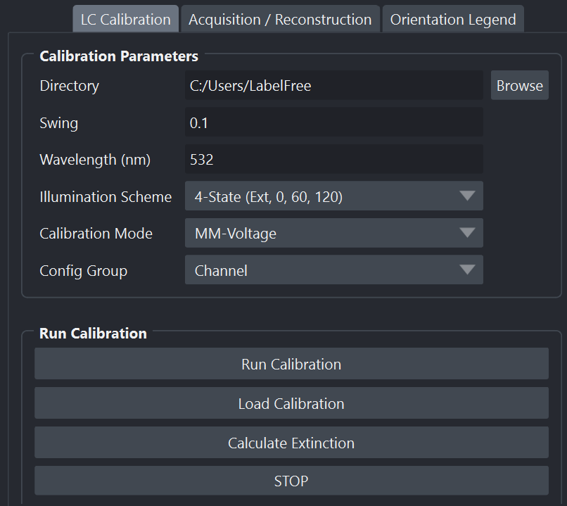


### Prepare for a calibration
Place your sample on the stage, focus on the surface of the coverslip/well, navigate to **an empty FOV**, then align the light source into **Kohler illumination** [following these steps](https://www.microscopyu.com/tutorials/kohler).

### Choose calibration parameters
Browse for and choose a **Directory** where you calibration and background images will be saved.

Choose a **Swing** based on the anisotropy of your sample. We recommend

* ​Tissue Imaging: `swing = 0.1 - 0.05`
* Live or fixed Cells: `swing = 0.05 – 0.03`

We recommend starting with a swing of **0.1** for tissue samples and **0.05** for cells then reducing the swing to measure smaller structures. See the [calibration guide](calibration-guide.md) for more information about this parameter and the calibration process.

Choose an **Illumination Scheme** to decides how many polarization states you will calibrate and use. We recommend starting with the *4-State (Ext, 0, 60, 120)* scheme as it requires one less illumination state than the *5-State* scheme.

**Calibration Mode** is set automatically, so the default value is a good place to start. Different modes allow calibrations with voltages, retardances, or hardware sequencing.

The **Config Group** is set automatically to the Micro-Manager configuration group that contains the `State*` presets. You can modify this option if you have multple configuration groups with these presets.

### Run the calibration
Start a calibration with **Run Calibration**.

The progress bar will show the progress of calibration, and it should take less than 2 minutes on most systems.

The plot shows the intensities over time during calibration. One way to diagnose an in-progress calibration is to watch the intensity plot. An ideal plot will look similar to the following:

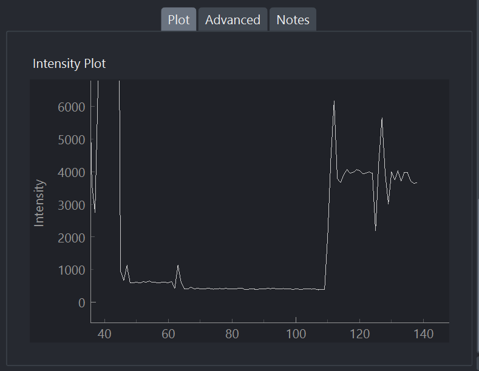

Once finished, you will get a calibration assessment and an extinction value. The extinction value gives you a metric for calibration quality: the higher the extinction, the cleaner the light path and the greater the sensitivity of QLIPP.

* **Extinction 0 – 50**:  Very poor. The alignment of the universal compensator may be off or the sample chamber may be highly birefringent.

* **Extinction 50 - 100**: Okay extinction, could be okay for tissue imaging and strong anisotropic structures. Most likely not suitable for cell imaging

* **Extinction 100 - 200**: Good Extinction. These are the typical values we get on our microscopes.

* **Extinction 200+**: Excellent. Indicates a very well-aligned and clean light path and high sensitivity of the system.

For a deeper discussion of the calibration procedure, swing, and the extinction ratio, see the [calibration guide](calibration-guide.md).

### Optional: Load Calibration
The **Load Calibration** button allows earlier calibrations to be reused. Select a *polarization_calibration.txt* file and Micro-Manager's presets will be updated with these settings. `waveorder` will also collect a few images to update the extinction ratio to reflect the current condition of the light path. Once this short acquisition has finished, the user can acquire data as normal.

This feature is useful if Micro-Manager and/or `waveorder` crashes. If the sample and imaging setup haven't changed, it is safe to reuse a calibration. Otherwise, if the sample or the microscope changes, we recommend performing a new calibration.

### Optional: Calculate Extinction
The **Calculate Extinction** button acquires a few images and recalculates the extinction value.

This feature is useful for checking if a new region of your sample requires a recalibration. If the sample or background varies as you move around the sample, the extinction will drop and you should recalibrate and acquire background images as close to the area you will be imaging as possible.

### Capture Background

The **Capture Background** button will acquire several images under each of the calibrated polarization states, average them (we recommend 5), save them to specified **Background Folder Name** within the main **Directory**, then display the result in napari layers.

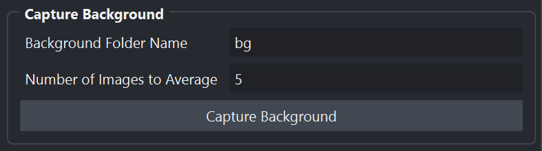

It is normal to see background retardance and orientation. We will use these background images to correct the data we collect our acquisitions of the sample.

### Advanced Tab
The advanced tab gives the user a log output which can be useful for debugging purposes. There is a log level “debugging” which serves as a verbose output. Look here for any hints as to what may have gone wrong during calibration or acquisition.

## Reconstruction Tab
The **Reconstruction** tab is designed to reconstruct `birefriengence, phase, birefrignence with phase, and flurescenece` datasets that have been either acquired or coverted to `.zarr` store as well as acquisitions that are in progress.

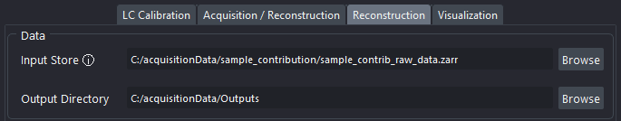

The **Input Store** and **Output Directory** point to the input and output `.zarr` data locations. Once an Input Store is selected some metadata parameters can be viewed by hovering the cursor over the `info label` ⓘ.

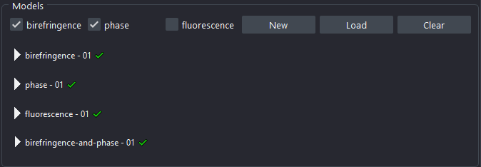

A `Model` defines the reconstruction parameters. Multiple models can be run against a dataset with varying parameters. The model generates a configuration file `.yml`, then uses the CLI to reconstruct the data with the configuration file, which makes all reconstructions exactly reproducible via a CLI.
* **New**: Builds a model based on the `Checkbox` selection.
* **Load**: Allows a model to be imported using a previous reconstruction `.yml` file.
* **Clear**: This will clear all defined models.

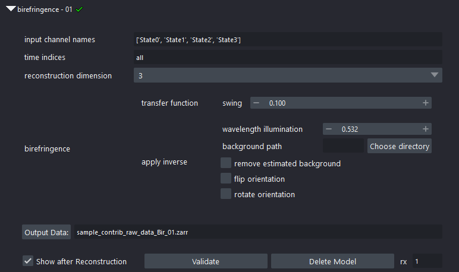

Once a `New` model is built, it is pre-populated with default values that can be accessed by clicking on the ► icon and the parameters can be changed as required.
See the [reconstruction guide](reconstruction-guide.md) for further information on the parameters.

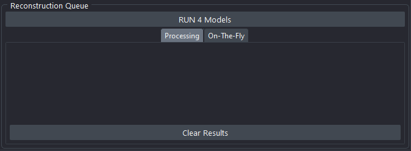

Once the **RUN** button is triggered, the reconstruction will proceed based on the defined model(s) concurrently.

> [!CAUTION]
> Since the models run concurrently, it is the users responsibility to manage compute resources accordingly on a local or SLURM system.

The `Reconstruction Queue` section will display the progress of the reconstruction in the form of text output. Once a reconstruction finishes the queue will self clear. Only in the case of any issues or error that are encountered the entry will remain.

Once the reconstruction processing finishes, based on the option `Show after Reconstruction` the reconstructed images will show up in the napari viewer.

### Recreating reconstructions
`waveorder`'s GUI acquires data from Micro-Manager, reads the GUI to generate a configuration file, then uses a CLI to reconstruct the acquired data with the configuration file, which makes all reconstructions exactly reproducible via a CLI. See the terminal that started napari for a log of the exact CLI commands that will reproduce the results in the napari window.

See the [reconstruction guide](reconstruction-guide.md) for CLI usage instructions.

## Visualizations
When an **Orientation*** layer appears at the top of the layers list, `waveorder` will automatically color it with an HSV color map that indicates the orientation.

If the **Orientation*** layer has a matching **Retardance*** layer in the layer list, a **BirefringenceOverlay*** layer that only shows orientation colors in regions with large retardance is generated. This overlay is computed lazily (when the slider moves), and this computation can be turned off by hiding the layer (eyeball in the layer list).

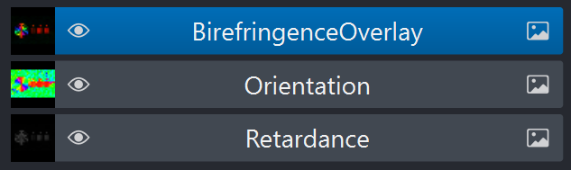

If the **BirefringenceOverlay*** needs to be regenerated, an **Orientation*** layer can be dragged to the top of the layer list:
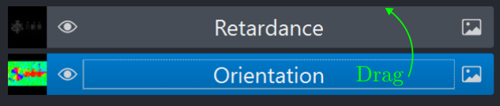

The **Visualization** tab shows the mapping between HSV colors and the orientation, and the **Overlay Retardance Maximum** slider controls the mapping between retardance values and saturated colors in the overlay.
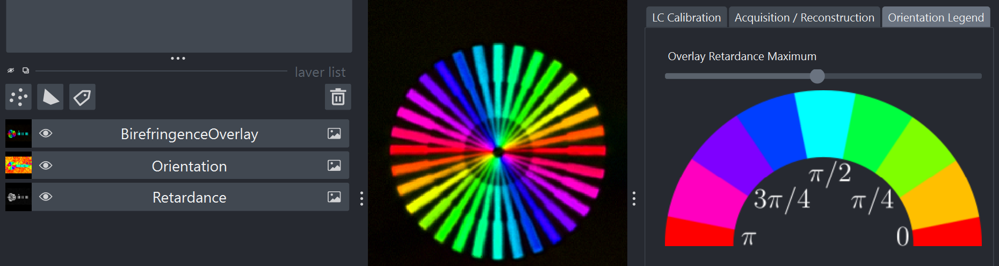
