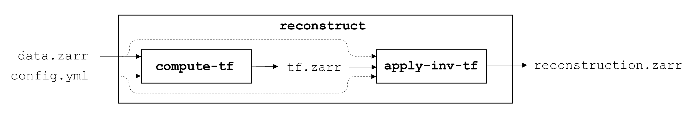

# Automating reconstructions

`waveorder` provides a configuration-file-based command-line interface (CLI) for file-based reconstruction. The separate tensor interface below provides opt-in optimized 3D phase reconstruction.

## Preparing your data

`waveorder` is compatible with OME-Zarr, a chunked next generation file format with an [open specification](https://ngff.openmicroscopy.org/0.4/). All acquisitions completed with the `waveorder` plugin will be automatically converted to `.zarr` format, and existing data can be converted using `iohub`'s `convert` utility.

Inside a `waveorder` environment, convert a Micro-Manager TIFF sequence, OME-TIFF, or pycromanager NDTiff dataset with
```
iohub convert `
    -i ./dataset/ `
    -o ./dataset.zarr
```

## How can I use `waveorder`'s CLI to perform reconstructions?
`waveorder`'s CLI is summarized in the following figure:


The main command `waveorder` command is composed of two subcommands: `compute-tf` and `apply-inv-tf`.

A reconstruction can be performed with a single `reconstruct` call. For example:
```
waveorder reconstruct `
    -i ./data.zarr/*/*/* `
    -c ./config.yml `
    -o ./reconstruction.zarr
```
Equivalently, a reconstruction can be performed with a `compute-tf` call followed by an `apply-inv-tf` call. For example:
```
waveorder compute-tf `
    -i ./data.zarr/0/0/0 `
    -c ./config.yml `
    -o ./tf.zarr

waveorder apply-inv-tf
    -i ./data.zarr/*/*/* `
    -t ./tf.zarr `
    -c ./config.yml `
    -o ./reconstruction.zarr
```
Computing the transfer function is typically the most expensive part of the reconstruction, so saving a transfer function then applying it to many datasets can save time.

## Input options

The input `-i` flag always accepts a list of inputs, either explicitly e.g. `-i ./data.zarr/A/1/0 ./data.zarr/A/2/0` or through wildcards `-i ./data.zarr/*/*/*`. The positions in a high-content screening `.zarr` store are organized into `/row/col/fov` folders, so `./input.zarr/*/*/*` creates a list of all positions in a dataset.

The `waveorder compute-tf` command accepts a list of inputs, but it only computes the transfer function for the first position in the list. The `apply-inv-tf` command accepts a list of inputs and applies the same transfer function to all of the inputs, which requires that all positions contain arrays with matching TCZYX shapes.

## What types of reconstructions are supported?
See `/waveorder/examples/` for a list of example configuration files.

WIP: This documentation will be expanded for each reconstruction type and parameter.

## Opt-in optimized 3D phase reconstruction

`waveorder.reconstruction.PhaseReconstruction` provides two implementations behind one callable interface. The existing model, xarray and CLI interfaces remain unchanged and available.

```python
import torch
from waveorder.reconstruction import PhaseReconstruction

# data and next_volume are contiguous float32 ZYX tensors on CUDA.
with PhaseReconstruction(
    tuple(data.shape),
    yx_pixel_size=0.2,
    z_pixel_size=0.5,
    wavelength_illumination=0.532,
    z_padding=20,
    index_of_refraction_media=1.33,
    numerical_aperture_illumination=0.6,
    numerical_aperture_detection=1.0,
    regularization_strength=0.01,
    backend="cuda",
    device=data.device,
) as reconstruct:
    phase = reconstruct(data)
    next_phase = reconstruct(next_volume)
    # phase remains valid after the second call and after the context closes.
    destination = torch.empty_like(data)
    reconstruct(next_volume, out=destination)
```

Use `backend="torch"` for the optimized PyTorch implementation on CPU or CUDA. Use `backend="cuda"` for the optional native Linux implementation, which requires CUDA-enabled PyTorch, a compatible CUDA toolkit and C++ compiler, and Ninja from `waveorder[native]`. Native compilation happens only when explicitly constructing the CUDA implementation, not when importing the namespace. `TORCH_EXTENSIONS_DIR` can place build files on suitable scratch storage. Loading failures are reported rather than switching backends.

Both implementations reconstruct one full float32 ZYX volume with Tikhonov regularization and no apodization. They preserve the complete transverse and axial Fourier domains. Optical slabs limit intermediate memory; they do not divide the specimen into independently reconstructed tiles. Results are float32 phase in cycles per voxel on the input device. Transfer to CPU explicitly with `phase.cpu()` when needed. Float64, batched volumes and apodization remain available through the existing interfaces; this new interface does not silently convert those requests.

Regularization must be a finite real scalar between zero and the float32 maximum, checked before conversion. Zero preserves singularities in the reference inverse rather than adding an epsilon. `absorption_ratio=None` omits absorption; a supplied ratio, including a learnable zero tensor, retains it.

The Torch implementation supports input, NA, tilt, regularization and absorption-ratio gradients. Scalar tensor parameters passed to the constructor remain live: each call reads their current values and creates a fresh optical/filter graph, so in-place optimizer updates are supported. Fixed Python scalar settings cache one filter while still allowing fresh input-gradient graphs. Sampling settings are fixed. Small-case gradient checks do not imply that a full-volume backward pass fits in memory.

The native implementation is inference-only. It snapshots fixed no-gradient parameters and rejects inputs or parameters that require gradients. Its optical filter is currently prepared with bounded Torch operations; the solve uses reusable cuFFT plans and native reduction, packing, filtering and output kernels. This is separate from the existing CUDA optical-fitting implementation.

Default outputs have stable caller-owned storage. `out=` explicitly reuses matching contiguous float32 output storage and rejects gradient-bearing tensors or input/output overlap. Native output kernels write directly into that destination without cloning a Plan-owned result. Finish reading an output before reusing it as `out`. When producing inputs or parameters on another CUDA stream, establish that dependency before the call. The reconstruction object orders its private filter and workspace operations.

Each object owns one prepared configuration and releases it on `close()` or context exit. Create a new object when fixed geometry, device or settings change. There is no hidden global GPU cache. Half-precision file storage or transport is a separate data-loading policy; this interface never quantizes float32 input to half.
