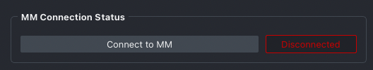
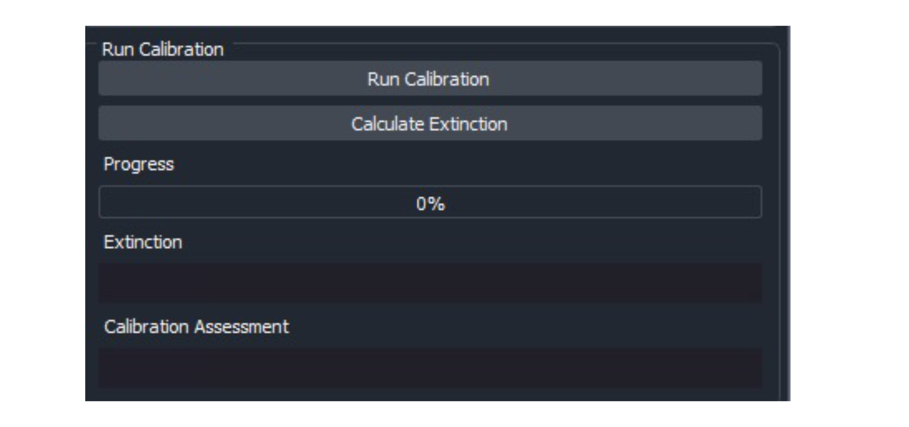
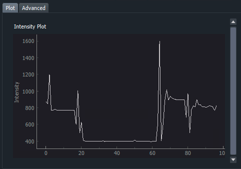
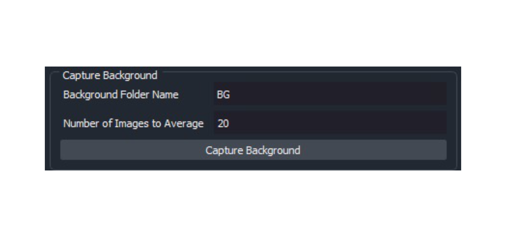
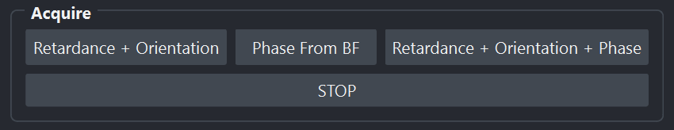
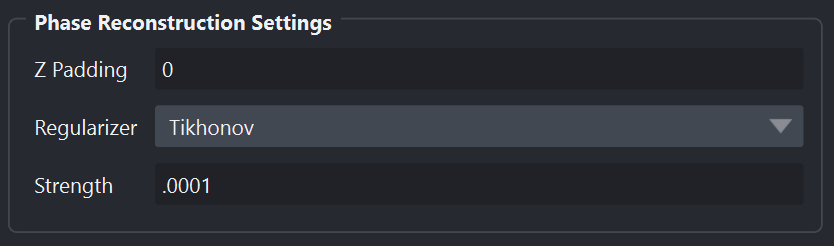
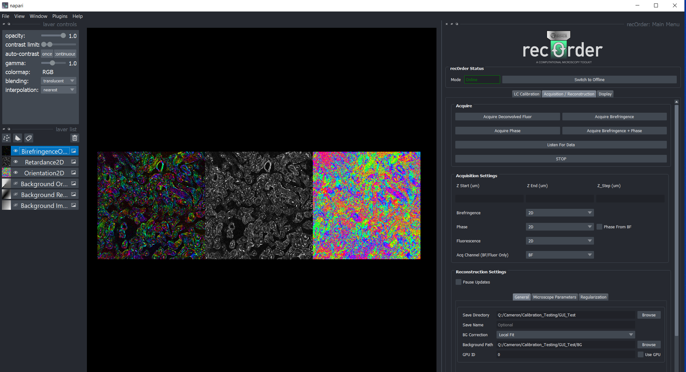

# Napari Plugin Guide
This guide summarizes a complete `recOrder` workflow. 

## Launch `recOrder`
Activate the `recOrder` environment
```
conda activate recOrder
```
   
Launch `napari` with `recOrder`
```
napari -w recOrder-napari
```
## Connect to Micro-Manager
Click “Connect to MM”. If the connection succeeds, proceed to calibration. If not, revisit the [microscope installation guide](./microscope-installation-guide.md).



For polarization imaging, start with the **Calibration** tab. For phase-from-brightfield imaging, you can skip the calibration and go to the **Aquisition / Reconstruction** tab.

## Calibration tab
The first step in the acquisition process is to calibrate the liquid crystals and measure a background. In the `recOrder` plugin you will see the following options for controlling the calibration:




### Prepare for a calibration
Place your sample on the stage, focus on the surface of the coverslip/well, navigate to **an empty FOV**, then align the light source into **Kohler illumination** [following these steps](https://www.microscopyu.com/tutorials/kohler).

### Choose calibration parameters
Browse for and choose a **Directory** where you calibration and background images will be saved.

Choose a **Swing** based on the anisotropy of your sample. We recommend

* ​Tissue Imaging: `swing = 0.1 - 0.05`
* Live or fixed Cells: `swing = 0.05 – 0.03`

We recommend starting with a swing of **0.1** for tissue samples and **0.05** for cells then reducing the swing to measure smaller structures. See the [calibration guide](./calibration-guide.md) for more information about this parameter and the calibration process. 

Choose an **Illumination Scheme** to decides how many polarization states you will calibrate and use. We recommend starting with the *4-State (Ext, 0, 60, 120)* scheme as it requires one less illumination state than the *5-State* scheme.

**Calibration Mode** is set automatically, so the default value is a good place to start. Different modes allow calibrations with voltages, retardances, or hardware sequencing. 

The **Config Group** is set automatically to the Micro-Manager configuration group that contains the `State*` presets. You can modify this option if you have multple configuration groups with these presets. 

### Run the calibration
Start a calibration with **Run Calibration**. 

The progress bar will show the progress of calibration, and it should take less than 2 minutes on most systems.

The plot shows the intensities over time during calibration. One way to diagnose an in-progress calibration is to watch the intensity plot. An ideal plot will look similar to the following:



Once finished, you will get a calibration assessment and an extinction value. The extinction value gives you a metric for calibration quality: the higher the extinction, the cleaner the light path and the greater the sensitivity of QLIPP.

* **Extinction 0 – 50**:  Very poor. The alignment of the universal compensator may be off or the sample chamber may be highly birefringent. 

* **Extinction 50 - 100**: Okay extinction, could be okay for tissue imaging and strong anisotropic structures. Most likely not suitable for cell imaging

* **Extinction 100 - 200**: Good Extinction. These are the typical values we get on our microscopes.

* **Extinction 200+**: Excellent. Indicates a very well-aligned and clean light path and high sensitivity of the system.

For a deeper discussion of the calibration procedure, swing, and the extinction ratio, see the [calibration guide](./calibration-guide.md).

### Optional: Load Calibration
The **Load Calibration** button allows earlier calibrations to be reused. Select a *polarization_calibration.txt* file and Micro-Manager's presets will be updated with these settings. `recOrder` will also collect a few images to update the extinction ratio to reflect the current condition of the light path. Once this short acquisition has finished, the user can acquire data as normal.  

This feature is useful if Micro-Manager and/or `recOrder` crashes. If the sample and imaging setup haven't changed, it is safe to reuse a calibration. Otherwise, if the sample or the microscope changes, we recommend performing a new calibration.

### Optional: Calculate Extinction
The **Calculate Extinction** button acquires a few images and recalculates the extinction value. 

This feature is useful for checking if a new region of your sample requires a recalibration. If the sample or background varies as you move around the sample, the extinction will drop and you should recalibrate and acquire background images as close to the area you will be imaging as possible.

### Capture Background

The **Capture Background** button will acquire several images under each of the calibrated polarization states, average them (we recommend 5), save them to specified **Background Folder Name** within the main **Directory**, then display the result in napari layers.



It is normal to see background retardance and orientation. We will use these background images to correct the data we collect our acquisitions of the sample. 

### Advanced Tab
The advanced tab gives the user a log output which can be useful for debugging purposes. There is a log level “debugging” which serves as a verbose output. Look here for any hints as to what may have gone wrong during calibration or acquisition.

## Acquisition / Reconstruction Tab
This acquisition tab is designed to acquire and reconstruct single volumes of both phase and birefringence measurements to allow the user to test their calibration and background. We recommend this tab for quick testing and the Micro-Manager MDA acquisition for high-throughput data collection.

### Acquire Buttons


The **Retardance + Orientation**, **Phase From BF**, and **Retardance + Orientation + Phase** buttons set off Micro-Manager acquisitions that use the upcoming acquisition settings. After the acquisition is complete, these routines will set off `recOrder` reconstructions that estimate the named parameters. 

The **STOP** button will end the acquisition as soon as possible, though Micro-Manager acquisitions cannot always be interrupted. 

### Acquisition Settings


The **Acquisition Mode** sets the target dimensions for the reconstruction. Perhaps surprisingly, all 2D reconstructions require 3D data except for **Retardance + Orientation** in **2D Acquisition Mode**. The following table summarizes the data that will be acquired when an acquisition button is pressed in **2D** and **3D** acquisition modes:

| **Acquisition** \ Acquisition Mode | 2D mode | 3D mode |  
| :--- | :--- | :--- |
| **Retardance + Orientation** | CYX data | CZYX data | 
| **Phase From BF** | ZYX data | ZYX data | 
| **Retardance + Orientation + Phase** | CZYX data | CZYX data | 

Unless a **Retardance + Orientation** reconstruction in **2D Acquisition Mode** is requested, `recOrder` uses Micro-Manager's z-stage to acquire 3D data. **Z Start**, **Z End**, and **Z Step** are stage settings for acquiring an image volume, relative to the current position of the stage. Values are in the stage's default units, typically in micrometers.

For example, to image a 20 um thick cell the user would focus in the middle of the cell then choose

* **Z Start** = -12
* **Z End** = 12
* **Z Step** =  0.25

For phase reconstruction, the stack should have about two depths-of-focus above and below the edges of the sample because the reconstruction algorithm uses defocus information to more accurately reconstruct phase.

### General Reconstruction Settings 


The **Save Directory** and **Save Name** are where the acquired data (`<save_dir>/<save_name>_snap_<n>/raw_data.zarr`) and reconstructions (`<save_dir>/<save_name>_snap_<n>/reconstruction.zarr`) will be saved. 

The **Background Correction** menu has several options (each with mouseover explanations):
* **None**: No background correction is performed. 
* **Measured**: Corrects sample images with a background image acquired at an empty field of view, loaded from **Background Path**, by default the most recent background acquisition. 
* **Estimated**: Estimates the sample background by fitting a 2D surface to the sample images. Works well when structures are spatially distributed across the field of view and a clear background is unavailable.
* **Measured + Estimated**: Applies a **Measured** background correction then an **Estimated** background correction. Use to remove residual background after the sample retardance is corrected with measured background.

The remaining parameters are used by the reconstructions:
 
* **GPU ID**: Not implemented
* **Wavelength (nm)**: illumination wavelength
* **Objective NA**: numerical aperture of the objective, typically found next to magnification
* **Condenser NA**: numerical aperture of the condenser
* **Camera Pixel Size (um)**: pixel size of the camera in micrometers (e.g. 6.5 μm)
* **RI of Obj. Media**: refractive index of the objective media, typical values are 1.0 (air), 1.3 (water), 1.473 (glycerol), or 1.512 (oil)
* **Magnification**: magnification of the objective
* **Rotate Orientation (90 deg)**: rotates "Orientation" reconstructions by +90 degrees clockwise and saves the result, most useful when a known-orientation sample is available
* **Flip Orientation**: flips "Orientation" reconstructions about napari's horizontal axis before saving the result
* **Invert Phase Contrast**: inverts the phase reconstruction's contrast by flipping the positive and negative directions of the stage during the reconstruction, and saves the result 

### Phase Reconstruction Settings


These parameters are used only by phase reconstructions

* **Z Padding**: The number of slices to pad on either end of the stack, necessary if the sample is not fully out of focus on either end of the stack
* **Regularizer**: Choose "Tikhonov", the "TV" regularizer is not implemented
* **Strength**: The Tikhonov regularization strength, too small/large will result in reconstructions that are too noisy/smooth

The acquired data will then be displayed in napari layers. Note that phase reconstruction is more computationally expensive and may take several minutes depending on your system.

Examples of acquiring 2D birefringence data (kidney tissue) with this snap method are below:



### Recreating reconstructions
`recOrder`'s GUI acquires data from Micro-Manager, reads the GUI to generate a configuration file, then uses a CLI to reconstruct the acquired data with the configuration file, which makes all reconstructions exactly reproducible via a CLI. See the terminal that started napari for a log of the exact CLI commands that will reproduce the results in the napari window. 

See the [reconstruction guide](./reconstruction-guide.md) for CLI usage instructions. 

## Visualizations
When an **Orientation*** layer appears at the top of the layers list, `recOrder` will automatically color it with an HSV color map that indicates the orientation. 

If the **Orientation*** layer has a matching **Retardance*** layer in the layer list, a **BirefringenceOverlay*** layer that only shows orientation colors in regions with large retardance is generated. This overlay is computed lazily (when the slider moves), and this computation can be turned off by hiding the layer (eyeball in the layer list).


If the **BirefringenceOverlay*** needs to be regenerated, an **Orientation*** layer can be dragged to the top of the layer list:


The **Visualization** tab shows the mapping between HSV colors and the orientation, and the **Overlay Retardance Maximum** slider controls the mapping between retardance values and saturated colors in the overlay.
