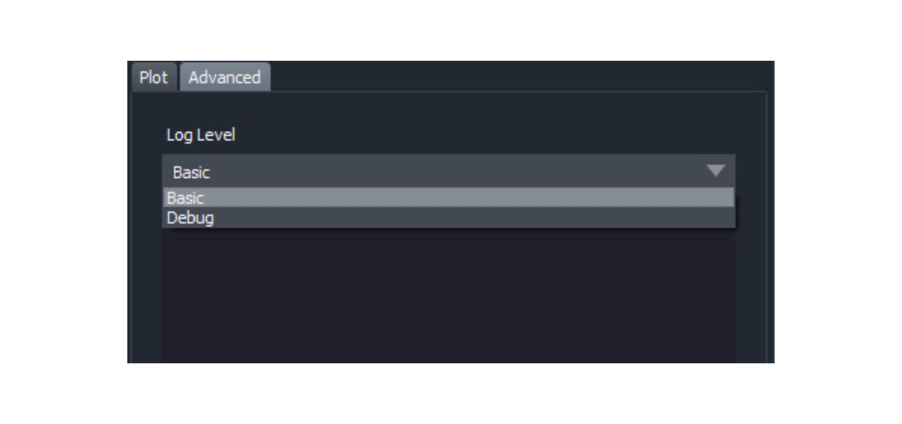
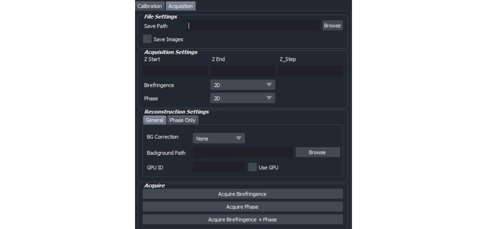
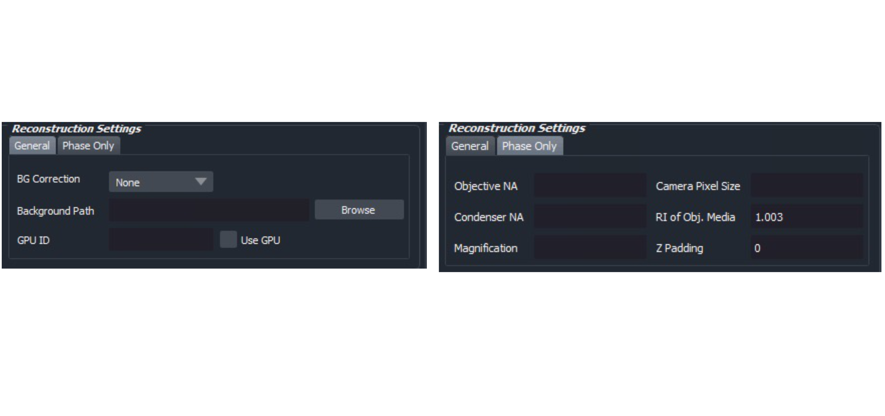

# recOrder User Guide

### Launching recOrder

1. Open Terminal and activate recOrder environment

   

   > conda activate recOrder

   

2. Launch recOrder with the command

   

   > recOrder-napari

   

3. Navigate to *Plugins > recOrder* 

### recOrder Calibration

 

The first step in the QLIPP process is to calibrate the universal polarizer. This process involves generating the polarization states and acquiring a background **on an empty FOV**.  The light path must also be in **Kohler Illumination** in order to ensure uniform illumination of the sample. Steps on Kohler illumination can be found here https://www.microscopyu.com/tutorials/kohler.

 

More info on the details of the calibration process can be found in the QLIPP Resources listed on Page1.

 

After pressing “Connect to MM” and choosing a directory, the first step in calibration is to input the illumination wavelength and decide on the swing to use. 

**Deciding Swing** 

Swing can be thought of as the deviation away from a perfectly circular illumination state. The greater the swing, the more elliptical the state becomes, until finally reaching a linear state at *swing = 0.25*. Picking a swing is dependent on the anisotropy of the sample. Typical swing values rang from *0.1 to 0.03.* Follow the guidelines below for an ideal swing setting.

 

​				<u>Live or fixed Cells:</u>     swing = 0.05 – 0.03

​				 <u>Tissue Imaging</u>:        swing = 0.1 - 0.05

 

We recommend using a swing of **0.1**  for most tissue samples and **0.05** for cells.

 

**Illumination Scheme**

The illumination scheme decides which polarization states to calibrate and use. We recommend sticking with the *4-State (Ext, 0, 60, 120)* scheme as it requires one less illumination state than the *5-State* scheme.

 

**Use Cropped ROI**

Calibration should be run on an empty field-of-view or “background” FOV in order to ensure that we are only compensating for the optical effects of the microscope and sample chamber. If you cannot find a fully empty FOV, you can draw a bounding box, or ROI, on the “Live Window” in MicroManager and check the *Use Cropped ROI* box

**Running Calibration**

Once the above parameters are set, the user is ready to run the calibration and the button can be pressed.

The progress bar will show the progress of calibration, and it should take less than 2 minutes on most systems.

 

The plot shows the Intensities over time during the optimization. One way to diagnose if calibration is going smoothly is to look at the shape of this plot. An example of an ideal plot is below:

 

Once finished, you will get a calibration assessment and an extinction value. The calibration assessment will tell you if anything is incorrect with the light path or if calibration went awry. Extinctions gives you a metric for calibration quality—the higher the extinction, the cleaner the light path and the greater the sensitivity of QLIPP.

 

<u>Extinction 0 – 50:</u>  Very poor. The alignment of the universal compensator may be off or the sample chamber may be highly birefringent.

 

<u>Extinction 50-100:</u> Okay extinction, could be okay for tissue imaging and strong anisotropic structures. Most likely not suitable for cell imaging

 

<u>Extinction 100-200:</u> Good Extinction. These are the typical values we get on our microscopes.

 

<u>Extinction 200+:</u> Phenomenal. Indicates a very well-aligned and clean light path.

 **Capturing Background**

The next important step in the calibration process. This will later serve in reconstruction to correct for any local and global background anisotropy. 

Choose the name of the folder to which to save your background images (will be placed into the save directory chosen at the beginning). Choose the number of images to average, 20 and below is generally good. 

 

*NOTE: If you wish the capture multiple background sets, please change the folder name in between captures as specifying the same name will overwrite previous data.*

 

**Advanced Tab**

The advanced tab gives the user a log output which can be useful for debugging purposes. There is a log level “debugging” which serves as a verbose output. Look here for any hints as to what may have gone wrong during calibration or acquisition.

### recOrder Acquisition

This acquisition module is designed to take single image volumes for both phase and birefringence measurements and allows the user to test the outcome of their calibration with small snapshots or volumes. *It should not be used as the main acquisition method for an experiment, please use the Micromanager MDA Acquisition instead.*

 

**Save Path**

User specifies the directory in which the images will be saved. Needed if the *Save Images* box is checked.

**Acquisition Settings**

*Z Start, Z End, Z Step* specify the relative z-parameters to use for acquiring an image volume. Values are in the default units of the stage, typically in microns. 

 

Ex. for a 20 um thick cell, the user would first focus in the middle of the cell and then set the following parameters: 

 

​									`Z Start: 	-12` 

​									 `Z End:	 12`

​									`Z Step:	 0.25` 

For phase reconstruction, the stack should have sufficient defocus along the top and bottom of the stack. The reconstruction algorithm uses the defocus information to more accurately reconstruct phase.

 

User can then choose whether they want to acquire a 2D or 3D Birefringence/Phase stack. Note that even for a 2D phase stack, a full image volume is required for reconstruction purposes.

**Reconstruction Settings** 

These settings are solely for reconstructing the acquired image / image volume. The *Phase Only* parameters are only needed for reconstructing phase. The user is able to specify the use of a GPU for reconstruction (requires CuPy / CudaToolKit) if present, otherwise leave blank.

Explanation of background correction methods:

 

<u>None:</u> No Background correction is performed. Not necessary to specify a background folder.

 

<u>Global:</u> A Global background correction is performed on every image by subtracting the background images from the sample in the stokes space.

 

<u>Local Fit:</u> A global background correction is formed and an additional estimation of local background is computed with a polynomial surface fit.

 

An explanation of phase reconstruction parameters:

 

<u>Objective NA:</u> Numerical Aperture of Objective, typically found next to magnification

<u>Condenser NA:</u> Numerical Aperture of Condenser

<u>Magnification:</u> Magnfication of the objective

<u>Camera Pixel Size:</u> Pixel size of the camera in microns (ex. 6.5)

<u>RI of Obj, Media:</u> Refractive Index of the objective media. Defaults to air (1.003). Typical values also include 1.512 (oil) or 1.473 (glycerol).

<u>Z Padding:</u> The number of slices to pad on either end of the stack in order to correct for edge reflection artifacts. Necessary if the sample is not fully out of focus on either end of the stack.

 

The acquired data will then be displayed in the Napari window. Note that phase reconstruction may take several minutes

### recOrder Reconstruction