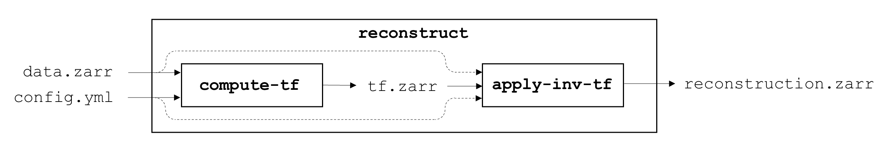

# Automating reconstructions

`recOrder` uses a configuration-file-based command-line interface (CLI) to perform all reconstructions.

## Preparing your data

`recOrder` is compatible with OME-Zarr, a chunked next generation file format with an [open specification](https://ngff.openmicroscopy.org/0.4/). All acquisitions completed with the `recOrder` plugin will be automatically converted to `.zarr` format, and existing data can be converted using `iohub`'s `convert` utility. 

Inside a `recOrder` environment, convert a Micro-Manager TIFF sequence, OME-TIFF, or pycromanager NDTiff dataset with
```
iohub convert `
    -i ./dataset/ `
    -o ./dataset.zarr
```

## How can I use `recOrder`'s CLI to perform reconstructions?
`recOrder`'s CLI is summarized in the following figure:


The main command `reconstruct` command is composed of two subcommands: `compute-tf` and `apply-inv-tf`. 

A reconstruction can be performed with a single `reconstruct` call. For example:
```
recorder reconstruct `
    -i ./data.zarr/*/*/* `
    -c ./config.yml `
    -o ./reconstruction.zarr
```
Equivalently, a reconstruction can be performed with a `compute-tf` call followed by an `apply-inv-tf` call. For example:
```
recorder compute-tf `
    -i ./data.zarr/0/0/0 `
    -c ./config.yml `
    -o ./tf.zarr

recorder apply-inv-tf 
    -i ./data.zarr/*/*/* `
    -t ./tf.zarr `
    -c ./config.yml `
    -o ./reconstruction.zarr
```
Computing the transfer function is typically the most expensive part of the reconstruction, so saving a transfer function then applying it to many datasets can save time. 

## Input options

The input `-i` flag always accepts a list of inputs, either explicitly e.g. `-i ./data.zarr/A/1/0 ./data.zarr/A/2/0` or through wildcards `-i ./data.zarr/*/*/*`. The positions in a high-content screening `.zarr` store are organized into `/row/col/fov` folders, so `./input.zarr/*/*/*` creates a list of all positions in a dataset. 

The `recorder compute-tf` command accepts a list of inputs, but it only computes the transfer function for the first position in the list. The `apply-inv-tf` command accepts a list of inputs and applies the same transfer function to all of the inputs, which requires that all positions contain arrays with matching TCZYX shapes.

## What types of reconstructions are supported?
See `/recOrder/examples/` for a list of example configuration files. 

WIP: This documentation will be expanded for each reconstruction type and parameter.
